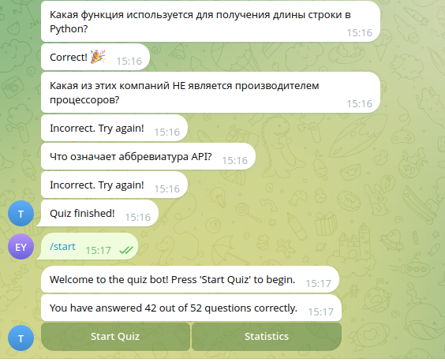

# aiogram-quiz-bot

[Quiz bot](https://t.me/send_riko_msg_pls_bot) для Telegram. aiogram3, sqlite3.
Для старта QUIZ'a необходимо ввести `/start`. 
`Start Quiz` - получение нового вопроса, на который в чате нужно ввести ответ.
`Statistics` - вывод статистики ответа на вопросы участником.

## Yandex_cloud

В папке yandex_cloud расположен код для использования в функции и запросах(sql.txt на базе ydb) в yandex cloud

## Установка

1) Скопируйте проект:
```bash
git clone https://github.com/Rikoze777/aiogram-quiz-bot
```

2) Создайте `.env` файл в корне проекта и добавьте туда переменные окружения по [примеру](env_example):
```bash
touch .env
```

### Запуск
1) Установите зависимости:
```bash
pip install -r requirements.txt
```

2) Создайте базу данных из [вопросов](questions.py). В результате должен появиться файл `quiz.db`:
```bash
python3 init_db.py
```

2) Запустите бота:
```bash
python3 bot.py
```

## Запуск через docker

1) После сборки можно проверять бота. Запуск сборки:
```bash
docker-compose up --build
```

2) Удаление:
```bash
docker-compose down --rmi all --volumes
```

## Пример работы


